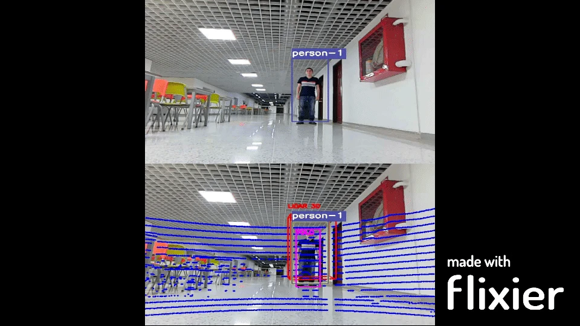
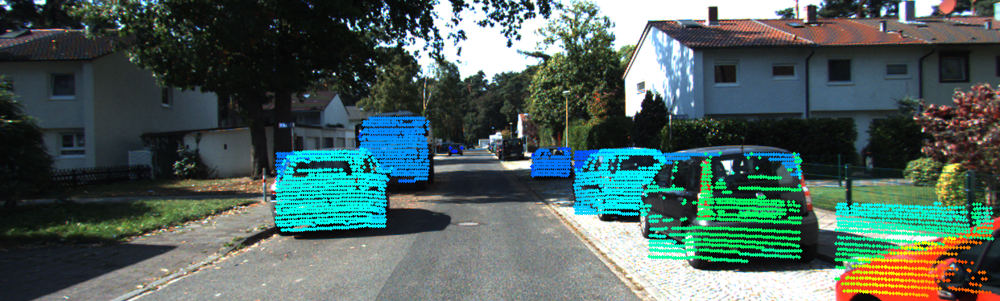
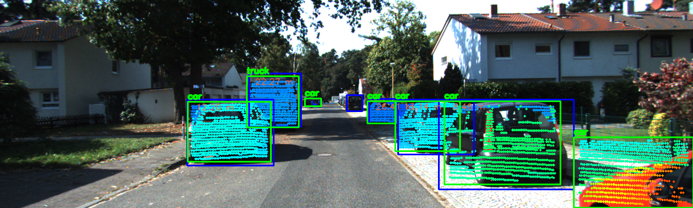

# Camera + 3D LiDAR sensor fusion for person detection

> **ES:** Código de mi trabajo de grado en Ingeniería Mecatrónica (Universidad Autónoma de
> Occidente, Cali): sistema de percepción para un robot móvil que reconoce y sigue personas en el
> campus fusionando una cámara y un LiDAR 3D. Este repositorio contiene la parte de **fusión**
> (detección 2D con YOLOv4 + proyección de la nube de puntos + asociación cámara-LiDAR). El
> seguimiento en tiempo real sobre ROS2 está en [tracker_fusion](https://github.com/alejandrofernandezurbano/tracker_fusion).



*Test on the UAO campus: YOLO detection on the camera (top) and the same person with the 3D
LiDAR points projected onto the image and the fused box (bottom).*

## About the thesis

Guiding people safely around a university campus is a job a mobile robot can do if it
perceives people reliably. The thesis tackles the perception part: recognising and tracking
people by **fusing a camera and a 3D LiDAR**, using existing models and datasets plus **our own
dataset recorded on the Universidad Autónoma de Occidente campus**. The system ran on a mobile
platform and was evaluated with real-time experiments. Results were acceptable given the
low-compute hardware it ran on, and the conclusion was that the tracking algorithm has room
for improvement.

**Keywords:** sensor fusion, 2D and 3D detection, multi-object tracking, mobile robot.

## How the fusion works

```
image ──► YOLOv4 (OpenCV DNN) ──► 2D boxes ─────────────┐
                                                        ├─► Hungarian matching (IoU) ─► fused objects
point cloud (.pcd) ──► project to image (calibration) ─┘        + distance per object
                       └─► 3D boxes projected to 2D
```

1. **2D detection:** YOLOv4 through OpenCV's DNN module (`YoloDetector.py`).
2. **Projection:** each LiDAR point is moved to the camera frame with the rigid transform
   `Tr_velo_to_cam`, rectified with `R0_rect` and projected with the camera matrix `P2`
   (`Lidar2Camera.py`, `LidarUtils.py`). Points outside the image are dropped.
3. **Distance per detection:** the LiDAR points that fall inside each 2D box give its depth;
   outliers are filtered and the remaining distances averaged (`FusionUtils.lidar_camera_fusion`).
4. **Association:** an IoU matrix between camera boxes and LiDAR boxes is solved with the
   Hungarian algorithm (`scipy.optimize.linear_sum_assignment`); pairs above the threshold
   become fused objects (`FusionUtils.associate`, `build_fused_object`).
5. **Tracking:** `FusionFinal.py` adds SORT on top of the fused detections.

## Results

| LiDAR points projected on the image | Fused result |
|---|---|
|  |  |


The sample frames and calibration files in `Data/` follow the **KITTI** format (and the
street samples come from the public KITTI dataset), which was used to develop and validate the
pipeline before moving to the campus recordings.

## Run it

```bash
pip install -r requirements.txt
# download the YOLOv4 weights (not stored in git, ~245 MB) into Data/model/yolov4/:
#   https://github.com/AlexeyAB/darknet/releases (yolov4.weights)
python main.py                    # mid-level fusion on frame 0, opens result windows
python main.py --index 3 --save   # another frame, saved to Data/output/images/
```

`--mode video` runs the low-level fusion over a recorded sequence in `Data/test/video4/`
(images + point clouds), not included because of its size.

## Layout

```
main.py            entry point (mid-level and low-level fusion)
FusionFinal.py     fusion + SORT tracking
Lidar2Camera.py    calibration loader (KITTI format)
LidarUtils.py      projection, 3D boxes, point-cloud helpers
FusionUtils.py     distance estimation and camera-LiDAR association
YoloDetector.py    YOLOv4 with OpenCV DNN
Data/              sample frames, point clouds, labels, calibration, outputs
meshes2/           robot meshes (STL)
```

## Stack

Python · OpenCV · YOLOv4 · Open3D · NumPy · SciPy · PyTorch · ROS2 (in tracker_fusion)

## Author

Alejandro Fernández Urbano — Mechatronics Engineer (UAO, 2024).
